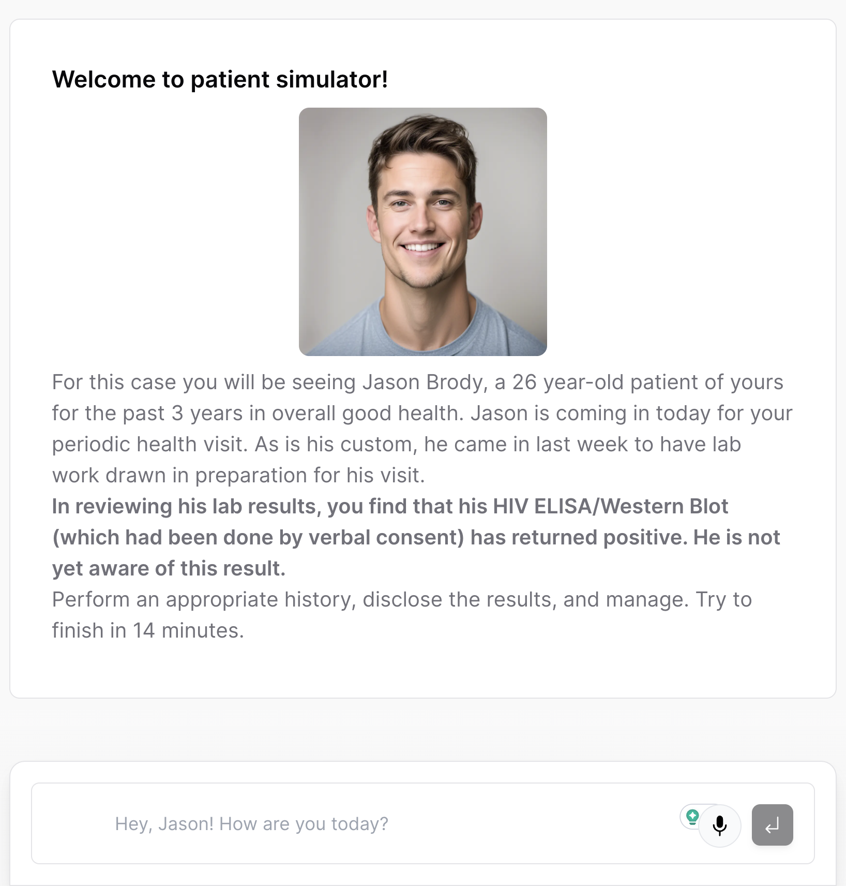

## Patient Simulator
A small web app for training medical students to interact with the patients.
You need to talk to Jason, a patient who recently got a positive HIV result, deliver him the news and handle his reaction and questions.

Functionality
- ChatGPT for analysis and conversation module
- ElevenLabs for voicing the patient lines
- Whisper for getting user's voice input
- Mock patient image with Stable diffusion

(really trying to hit the GenAI bingo)

Submision for [ElevenLabs AI Hackathon](https://lablab.ai/event/eleven-labs-ai-hackathon)

Repo adapted from [Vercel AI chatbot](https://github.com/vercel-labs/ai-chatbot/tree/main) 